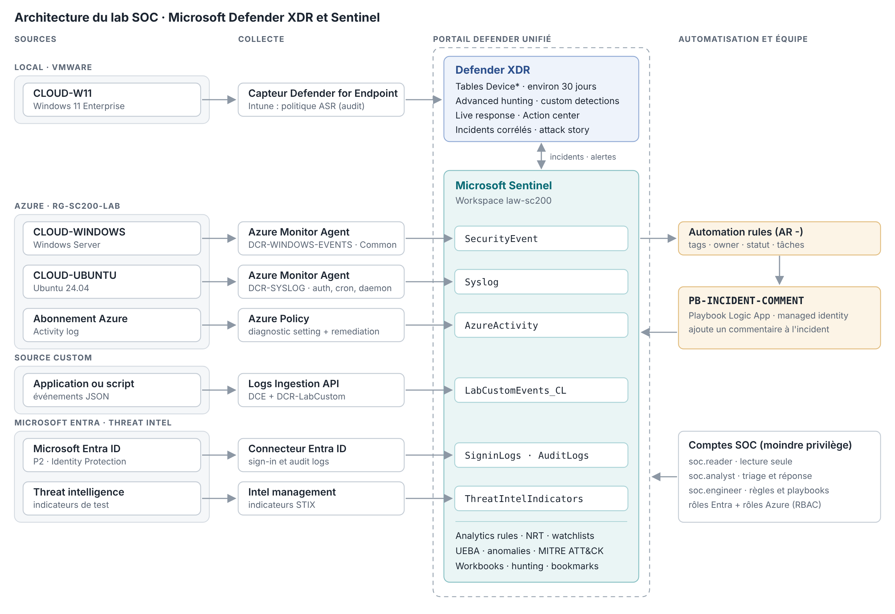

# 🛡️ SOC Lab · Microsoft Defender XDR et Sentinel

Laboratoire SecOps Microsoft monté de zéro dans un seul tenant, en vue de la certification **SC-200 (Microsoft Security Operations Analyst)**.

> 💡 Chaque phase est documentée de bout en bout, y compris ce qui a échoué et comment je l'ai corrigé :  
>  ```ingestion → détection → automatisation → investigation → hunting → gestion des vulnérabilités```.

---

## 🎯 Objectif

Pratiquer chaque compétence mesurée par la SC-200 dans un vrai tenant, plutôt que de l'étudier seulement en théorie :

- **Microsoft Sentinel** comme SIEM, sur un Log Analytics workspace.
- **Defender XDR** et **Defender for Endpoint** dans le portail Defender unifié
- **Entra ID P2** (Identity Protection) et **Intune** pour l'identité et les appareils
- **Logic Apps** pour l'automatisation de la réponse
- **Defender Vulnerability Management** pour le cycle de gestion des vulnérabilités

---

## 🖥️ Architecture



VMs :

- `CLOUD-W11` (VMware, local) : Windows 11 Enterprise, onboardé dans **Defender for Endpoint** et enrôlé dans **Intune**
- `CLOUD-WINDOWS` (Azure) : Windows Server, security events vers Sentinel via **AMA** et une **DCR**
- `CLOUD-UBUNTU` (Azure) : Ubuntu 24.04, Syslog vers Sentinel via **AMA** et une **DCR**

Sources connectées à Sentinel (`law-sc200`) :

- Entra ID (sign-in logs et audit logs), Azure Activity, threat intelligence (STIX)
- Incidents et alertes Defender XDR, synchronisés automatiquement
- Une table custom (`LabCustomEvents_CL`) créée pour la Logs Ingestion API (DCE + DCR)

Comptes SOC, selon le principe du moindre privilège :

| Compte | Rôle SOC | Rôle Entra (Defender XDR) | Rôles Azure (Sentinel) |
|--------|----------|---------------------------|------------------------|
| `soc.reader` | Observateur | Security Reader | Microsoft Sentinel Reader |
| `soc.analyst` | Triage et réponse | Security Operator | Microsoft Sentinel Responder + Playbook Operator |
| `soc.engineer` | Règles, connecteurs, workbooks, playbooks | Security Administrator | Microsoft Sentinel Contributor + Logic App Contributor |
| `soc.target1`, `soc.target2` | Utilisateurs ciblés par les tests | NA | NA |


---

## ⚡ Workflow opérationnel

1. **Ingestion**
   - Data connectors via AMA et DCR (Windows, Syslog), Azure Policy (Azure Activity), Entra ID, threat intelligence

2. **Détection**
   - Analytics rules en KQL (scheduled, NRT, watchlist) et custom detection dans Defender XDR
   - UEBA, anomalies en Flighting, TI map, analyse de couverture MITRE ATT&CK

3. **Automatisation**
   - Playbook Logic Apps `PB-INCIDENT-COMMENT` (managed identity) déclenché par une automation rule
   - Automation rules de triage : tags, assignation, statut

4. **Investigation et réponse**
   - Triage, attack story, entités, device timeline
   - Live response, collecte d'investigation package, isolement d'appareil
   - Identity Protection : connexion Tor détectée, compte confirmé compromis, sessions révoquées

5. **Threat hunting**
   - Advanced hunting (Defender XDR) et hunting queries Sentinel, bookmarks

6. **Gestion des vulnérabilités**
   - Inventaire, priorisation des CVE en KQL, demande de remédiation via Intune, vérification

---

## 🔎 Détections

| Règle | Type | MITRE ATT&CK | Test | Requête |
|-------|------|--------------|------|---------|
| SR - MULTIPLE FAILED LOGONS | Scheduled rule (5 min) | [T1110](https://attack.mitre.org/techniques/T1110/) | 6+ mots de passe RDP erronés | [KQL](kql/detections/SR-MULTIPLE-FAILED-LOGONS.kql) |
| NRT - USER ACC CREATED | NRT rule | [T1136](https://attack.mitre.org/techniques/T1136/) | `net user … /add` | [KQL](kql/detections/NRT-USER-ACC-CREATED.kql) |
| SR - VIP SIGN-IN FAILURES | Scheduled rule + watchlist | [T1110](https://attack.mitre.org/techniques/T1110/) | 3+ échecs pour un compte VIP | [KQL](kql/detections/SR-VIP-SIGNIN-FAILURES.kql) |
| CD - ENCODED POWERSHELL | Custom detection (Defender XDR) | [T1059.001](https://attack.mitre.org/techniques/T1059/001/) | `powershell -enc …` | [KQL](kql/detections/CD-ENCODED-POWERSHELL.kql) |
| TI map IP entity to SigninLogs | Template (threat intelligence) | IOCs | Connexion depuis une IP signalée | Template Content hub |
| Anomalous RDP Login Detection | ML behavior analytics | [T1078](https://attack.mitre.org/techniques/T1078/) | Après une semaine de baseline RDP | Template Microsoft |

---

## 📊 Résultats

- ✅ 6 sources ingérées dans Sentinel et validées par requête, plus une table custom créée pour la Logs Ingestion API.
- ✅ 4 détections en KQL créées et testées contre des attaques simulées, chacune mappée à MITRE ATT&CK.
- ✅ UEBA activé (sign-ins, audit, security events, Azure Activity, `DeviceLogonEvents`) et une anomaly rule ajustée en Flighting.
- ✅ TI map : alerte sur une connexion depuis une IP signalée par un indicateur de test.
- ✅ Automation rules : tags, assignation et statut appliqués automatiquement à la création d'un incident.
- ✅ Identity Protection : connexion Tor détectée (Anonymous IP address) quelques minutes après une connexion légitime.
- ✅ Investigation complète des incidents : live response, investigation package, isolement et libération de `CLOUD-W11`.
- ✅ Threat hunting : advanced hunting et hunting queries Sentinel, avec bookmark rattaché à un incident.
- ✅ Gestion des vulnérabilités : CVE introduite, priorisée, remédiée via Intune et vérifiée par la baisse de l'exposure score.

---

## 📂 Documentation

👉 [Guide détaillé des phases](GUIDE.md)  
👉 [Requêtes KQL](kql/) : détections, hunting et workbook  
👉 [Automatisation](automation/README.md) : playbook et automation rules  
👉 [Rapports d'incident](rapports/README.md)

```
SOC-SC200-Lab/
├── GUIDE.md                 # phases 0 à 6, étape par étape
├── kql/
│   ├── detections/          # analytics rules et custom detection
│   ├── hunting/             # advanced hunting et vulnérabilités
│   └── workbook/            # requêtes du workbook Lab SOC overview
├── watchlists/LabVIPs.csv   # watchlist de la règle VIP
├── automation/              # playbook PB-INCIDENT-COMMENT et automation rules
├── rapports/                # rapports d'incident
└── images/                  # captures d'écran
```

---

## ⚠️ Disclaimer

Ce projet est un lab pédagogique destiné à l'apprentissage et à la préparation de la SC-200.  
- Les attaques sont simulées sur des VM et des comptes de test, jamais sur un poste personnel ou un environnement de production.
- Les noms de tenant, adresses IP publiques et identifiants réels ont été retirés/embués.
- Les configurations sont simplifiées à des fins d'étude et ne constituent pas une solution prête pour la production.

---

*Dernière mise à jour : octobre 2026*
